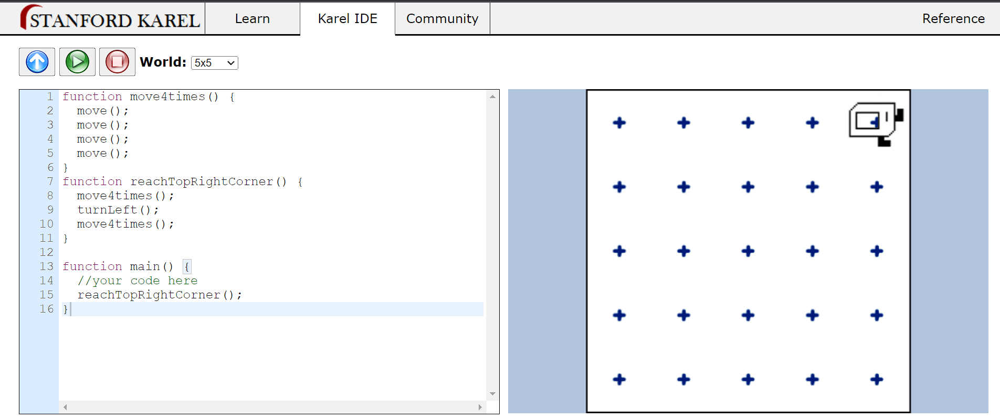
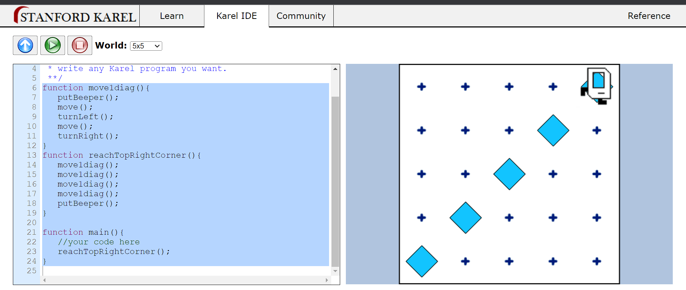
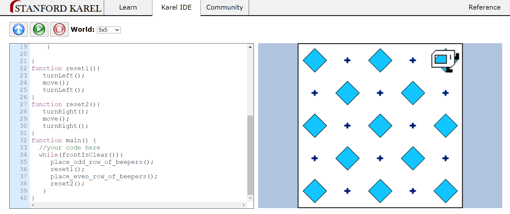

# Section 14 : Introduction to Javascript or ES6

_JavaScript_ is a versatile and widely-used programming language that allows you to add interactivity and dynamic behavior to websites and web applications. It is often used for front-end development, enabling you to create responsive and interactive user interfaces. JavaScript can also be used on the server-side with platforms like Node.js for building full-stack applications.

**Key points about JavaScript:**

1. Client-Side Language: JavaScript is primarily a client-side scripting language, which means it runs in a user's web browser. It can manipulate HTML and CSS to create dynamic web content.

2. Versatile: JavaScript is not limited to web development. It can be used in various contexts, including mobile app development, game development, and server-side scripting.

3. Syntax: JavaScript's syntax is similar to other programming languages like C++ and Java, making it accessible to a broad range of developers.

4. Event-Driven: JavaScript is event-driven, meaning it can respond to user actions (clicks, inputs, etc.) and execute code accordingly.

5. Libraries and Frameworks: JavaScript has a rich ecosystem of libraries and frameworks like React, Angular, and Vue.js, which simplify the development of complex web applications.

6. Cross-Browser Compatibility: JavaScript is supported by all major web browsers, ensuring that your code works consistently across different platforms.

7. Asynchronous Programming: JavaScript supports asynchronous programming, allowing you to perform tasks like making API calls or handling user input without blocking the main thread of execution.

8. Object-Oriented: JavaScript is an object-oriented language, and many aspects of web development in JavaScript involve working with objects and prototypes.

9. Community and Resources: There is a large and active JavaScript community with plenty of resources, tutorials, and forums to help developers learn and solve problems.

**Note**:

- Similar to python Javascript is also a interpreter based language.
- Principles of writing consistent, idiomatic Javascript [[link](https://github.com/rwaldron/idiomatic.js/)]

## `alert()` function

`alert()` function to display a pop-up alert dialog with a message. This is a simple way to provide information or interact with the user. Here's how to use the alert() function:

```javascript
alert("This is an alert message.");
```

## `prompt()` function

The `prompt()` function is used to display a dialog box that prompts the user to enter input. It can be used to collect data or information from the user by requesting them to type something into an input field in the dialog box. Here's the basic syntax of the prompt() function:

```javascript
let userInput = prompt("Please enter some information:");
```

## Variables in Javascript

Variables are used to store and manage data. Variables allow you to store values, such as numbers, strings, objects, or functions, and manipulate them in your code. Here's how you declare and use variables in JavaScript:

1. **Variable Declaration**: You can declare a variable using the var, let, or const keyword. The choice of keyword affects the variable's scope and mutability:

   - `var`: Variables declared with var have function-level scope and can be redeclared within the same scope. However, they are less commonly used due to scoping issues.
   - `let`: Variables declared with let have block-level scope and can be reassigned. They are commonly used for variables whose values change.
   - `const`: Variables declared with const have block-level scope and cannot be reassigned once a value is assigned. They are often used for constants or variables whose values should not change.

```javascript
let name = "John"; // Declaring a variable 'name' and assigning a string value to it.
const age = 30; // Declaring a constant variable 'age' and assigning a numeric value.
```

2. **Variable Naming Rules**: Variable names can contain letters, digits, underscores, and dollar signs. They must begin with a letter, underscore, or dollar sign. Variable names are case-sensitive.

```javascript
let myVariable;
let user_age;
let $price;
```

3. **Data Types**: JavaScript is a dynamically typed language, meaning variables can hold values of different data types. Common data types include strings, numbers, booleans, arrays, objects, and functions.

```javascript
let name = "Alice"; // string
let age = 25; // number
let isStudent = true; // boolean
let colors = ["red", "green", "blue"]; // array
let person = { firstName: "John", lastName: "Doe" }; // object
function greet() {
  console.log("Hello!");
} // function
```

4. **Scope**: Variables have different scopes depending on where they are declared. `let` and `const` have block-level scope, while `var` has function-level scope.

```javascript
if (true) {
  let localVar = "I am inside the block";
  console.log(localVar); // 'I am inside the block'
}
console.log(localVar); // Error: localVar is not defined
```

5. **Hoisting**: Variable declarations with `var` are hoisted to the top of their containing function or global scope, which means you can access them before they are declared in your code. However, their values are initialized to `undefined` until the actual assignment occurs.

```javascript
console.log(x); // undefined
var x = 5;
console.log(x); // 5
```

Variables declared with `let` and `const` are also hoisted but are not initialized until the actual declaration is reached in the code.

## String Operations

### String Concatenation

In JavaScript, string concatenation is the process of combining two or more strings to create a new string. There are several ways to concatenate strings in JavaScript:

1. **Using the + Operator**: You can use the `+` operator to concatenate strings. This operator also allows you to concatenate strings with variables or literals.

```javascript
const firstName = "John";
const lastName = "Doe";
const fullName = firstName + " " + lastName;
console.log(fullName); // 'John Doe'
```

2. **Using Template Literals**: Template literals (introduced in ECMAScript 6) provide a more concise and readable way to concatenate strings. They use backticks (\`) and allow you to include variables and expressions within \`${}\` placeholders.

```javascript
const firstName = "John";
const lastName = "Doe";
const fullName = `${firstName} ${lastName}`;
console.log(fullName); // 'John Doe'
```

3. **Using the `concat()` Method**: The `concat()` method is available for strings and is used to concatenate one or more strings together. You can chain `concat()` calls for multiple concatenations.

```javascript
const str1 = "Hello";
const str2 = "World";
const result = str1.concat(" ", str2);
console.log(result); // 'Hello World'
```

### String Length

To determine the length of a string (i.e., the number of characters in the string) using the `length` property. Here's how to use it:

```javascript
const str = "Hello, World!";
const length = str.length;

console.log(length); // 13
```

### String slicing

the `slice()` method is used to extract a portion of a string and create a new string with the extracted characters. The `slice()` method takes two parameters: the _starting index_ and an optional _ending index_ (exclusive). Here's the syntax:

```javascript
string.slice(startIndex, endIndex);

const str = "Hello, World!";

// Extract from index 0 to 5 (exclusive)
const extracted1 = str.slice(0, 5);
console.log(extracted1); // 'Hello'

// Extract from index 7 to the end
const extracted2 = str.slice(7);
console.log(extracted2); // 'World!'

// Negative index to count from the end
const extracted3 = str.slice(-6, -1);
console.log(extracted3); // 'World'
```

### Other Useful string methods

1. `toUpperCase()`: This method converts all characters in a string to uppercase.

```javascript
const str = "Hello, World!";
const upperCaseStr = str.toUpperCase();
console.log(upperCaseStr); // 'HELLO, WORLD!'
```

2. `toLowerCase()`: This method converts all characters in a string to lowercase.

```javascript
const str = "Hello, World!";
const lowerCaseStr = str.toLowerCase();
console.log(lowerCaseStr); // 'hello, world!'
```

**Problem 1**
Capitalize the first character of the input string while keeping the rest in lower case.
**Solution**

```javascript
var name = prompt("What's your name?");
// Formatting name
firstChar = name.slice(0, 1).toUpperCase();
remainingText = name.slice(1).toLowerCase();
resultName = firstChar + remainingText;
alert("Hello! " + resultName);
```

**Problem 2**
Implement below logic using arithmetic operators.

> a = (b - 2) x 4 + 21

**Solution**

```javascript
var dogAge = prompt("Enter your dog's age:");
humanAge = (dogAge - 2) * 4 + 21;
alert("Human Equivalent age: " + humanAge);
```

## Increment and Decrement Expressions

Increment and decrement expressions in JavaScript are used to increase or decrease the value of a numeric variable by a specific amount. These expressions are commonly used in loops and for updating variables. JavaScript provides two main operators for these operations: the increment (++) and decrement (--) operators.

### Increment (++) Operator:

The increment operator (++) is used to increase the value of a variable by 1. It can be applied in two ways: as a postfix or a prefix operator.

#### Postfix Increment:

```javascript
let x = 5;
let y = x++;
console.log(x); // 6 (x is incremented after assigning to y)
console.log(y); // 5 (original value of x)
```

#### Prefix Increment:

```javascript
let x = 5;
let y = ++x;
console.log(x); // 6 (x is incremented before assigning to y)
console.log(y); // 6 (new value of x)
```

### Decrement (--) Operator:

The decrement operator (--) is used to decrease the value of a variable by 1. It also has postfix and prefix forms.

#### Postfix Decrement:

```javascript
let x = 5;
let y = x--;
console.log(x); // 4 (x is decremented after assigning to y)
console.log(y); // 5 (original value of x)
```

#### Prefix Decrement:

```javascript
let x = 5;
let y = --x;
console.log(x); // 4 (x is decremented before assigning to y)
console.log(y); // 4 (new value of x)
```

**Problem 3**
Move "Karel" to the top right corner. [[src](https://stanford.edu/~cpiech/karel/ide.html)]
**Solution**

```javascript
function move4times() {
  move();
  move();
  move();
  move();
}
function reachTopRightCorner() {
  move4times();
  turnLeft();
  move4times();
}

function main() {
  //your code here
  reachTopRightCorner();
}
```



**Problem 4**
Ask "Karel" to put beeper in the diagonal checkpoints. [[src](https://stanford.edu/~cpiech/karel/ide.html)]
**Solution**

```javascript
function move1diag() {
  putBeeper();
  move();
  turnLeft();
  move();
  turnRight();
}
function reachTopRightCorner() {
  move1diag();
  move1diag();
  move1diag();
  move1diag();
  putBeeper();
}

function main() {
  //your code here
  reachTopRightCorner();
}
```



**Problem 5**
Ask "Karel" to put beeper in the so that pattern represents a chessboard. [[src](https://stanford.edu/~cpiech/karel/ide.html)]
**Solution**

```javascript
function place_odd_row_of_beepers() {
  while (frontIsClear()) {
    putBeeper();
    move();
    if (frontIsClear()) {
      move();
    }
  }
  putBeeper();
}
function place_even_row_of_beepers() {
  while (frontIsClear()) {
    move();
    putBeeper();
    if (frontIsClear()) {
      move();
    }
  }
}
function reset1() {
  turnLeft();
  move();
  turnLeft();
}
function reset2() {
  turnRight();
  move();
  turnRight();
}
function main() {
  //your code here
  while (frontIsClear()) {
    place_odd_row_of_beepers();
    reset1();
    place_even_row_of_beepers();
    reset2();
  }
}
```


