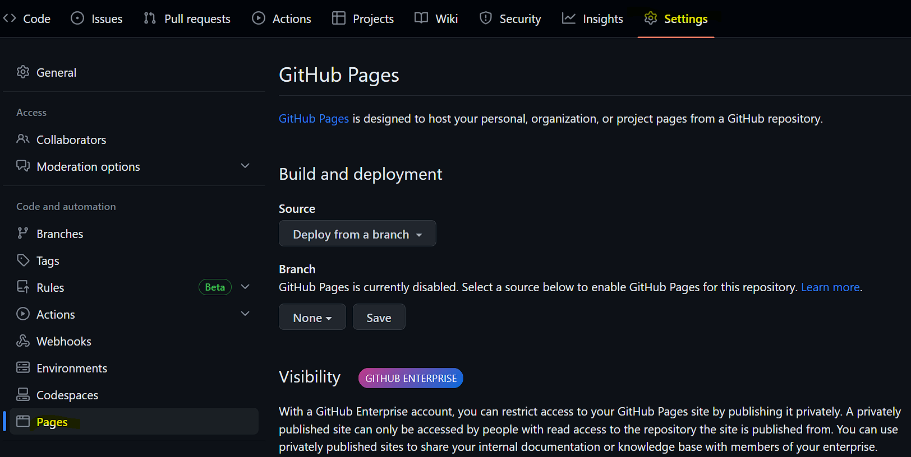
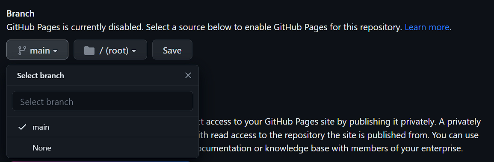
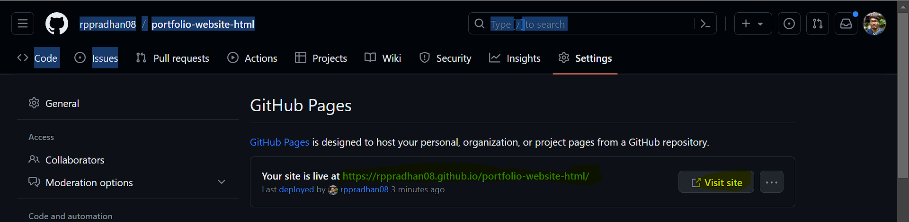

# Section 3 : Multi-Page Websites HTML

## Computer File Paths

File paths can be of 2 types:

1. **Absolute filepath**: This file path is relative to the root directory of the computer, for example: `/Raj/Courses/Web Development Resources/file.txt`. In this example, `/` denotes the root directory.

2. **Relative filepath**: This file path is relative to the current folder/directory, for example: `home/dir/file.txt`. In this example, `home` represents the current directory. Below are a few special characters commonly used when working with relative file paths.

> - `../`: This notation is used to go up a level in the directory hierarchy. For example, `../file.txt` indicates accessing the file named `file.txt` located in the parent directory.

> - `./`: This notation is used to refer to the current directory. For example, `./file.txt` indicates accessing the file named `file.txt` located in the current directory.

## Referencing webpages in `index.html`

Relative file path is being used to access or reference different html pages or assets in a directory. eg:
`<a href="./about_me.html>About Me</a>`

## The HTML Boilerplate

Boilerplate help us understand the structure of a HTML file. Example of a boilerplate shown below:

```HTML
<!DOCTYPE html>
<html lang="en">
    <head>
        <!--Contains the meta-data about the webpage-->
        <meta charset="UTF-8">
        <meta name="viewport" content="width=device-width, initial-scale=1.0">
        <title>Document</title>
    </head>
    <body>

    </body>
</html>
```

> Shortcut to create Boilerplate in VSCode
>
> 1. Create file with extension \*.html.
> 2. Open file and type `!` and press `Enter`

## Hosting the static website on Github Pages

Steps to host a static HTML website on Github Pages:

1. Create a new repo in [GitHub](https://github.com/rppradhan08)

2. Upload the content of the Github website to [repo](https://github.com/rppradhan08/portfolio-website-html)

3. Verify all the artifacts where uploaded successfully. Make sure the base html file is named as `index.html`

4. Navigate to `Settings -> Pages`
   

5. Change the Branch from `none` to `main` & click `Save`.
   

6. Once the website is deployed below message should appear. Link to DEMO website [here](https://rppradhan08.github.io/portfolio-website-html/).
   
